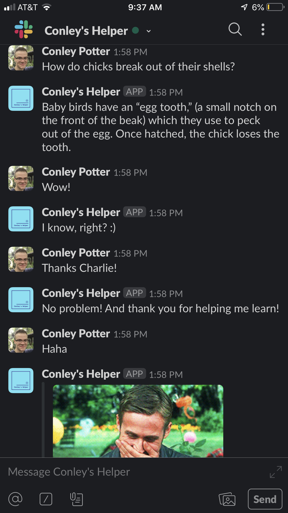

# GameHub

## Technologies:

* Google Firestore
  * Database used to store data
* Express
  * JavaScript (ES6) backend API
* Google Cloud Functions
  * Used to create DB rules
* Google Dialogflow
  * NLU (Natural Language Understanding) API
#



# Features

Charlie, Conley's Helper is an experiment in designing and deploying a friendly converastional chat bot. The major features include:

* Users can interact with Charlie (though they currently need an invite link since he is deployed in Alpha) through any Google Assistant equiped device
* Charlie can have fun converastions
  * He has a number of pre-programmed responses to generic questions such as: 
    * How are you today? 
    * Who are you?
    * What do you like to do?
    * Etc...
  * Charlie also has a limited knowledge of certain subjects such as quirky animal facts.
* Charlie can learn a user's name and use it for the duration of a conversation, the name is then stored in Google Firestore
* Charlie utilizes the Giphy API so that he can respond with fun Gifs

## Future Developments Coming Soon: 
* Associating users' Google accounts with their learned names
* Deploying to Beta
* More topics of conversations

## Featured Features

* Charlie's name-learning feature was accopmlished through a combination of Dialogflow's JavaScript (ES6) API, Google Firestore, and Google Cloud Functions

* The was accomplished with the following code:

```javascript
exports.dialogflowFirebaseFulfillment = functions.https.onRequest((request, response) => {
	const agent = new WebhookClient({request, response});

	function saveName(agent) {
		const firstNameParam = agent.parameters.firstName;
		const lastNameParam = agent.parameters.lastName;
		const firstName = firstNameParam;
		const lastName = lastNameParam;

		agent.add("Oh, your name is " + firstName + " " + lastName + "!");

		return admin.database().ref('/users').push({
			firstName: firstName,
			lastName: lastName
		});
		
	}

	let intentMap = new Map();
	intentMap.set("userTellsName", saveName);
	agent.handleRequest(intentMap);
});
```
